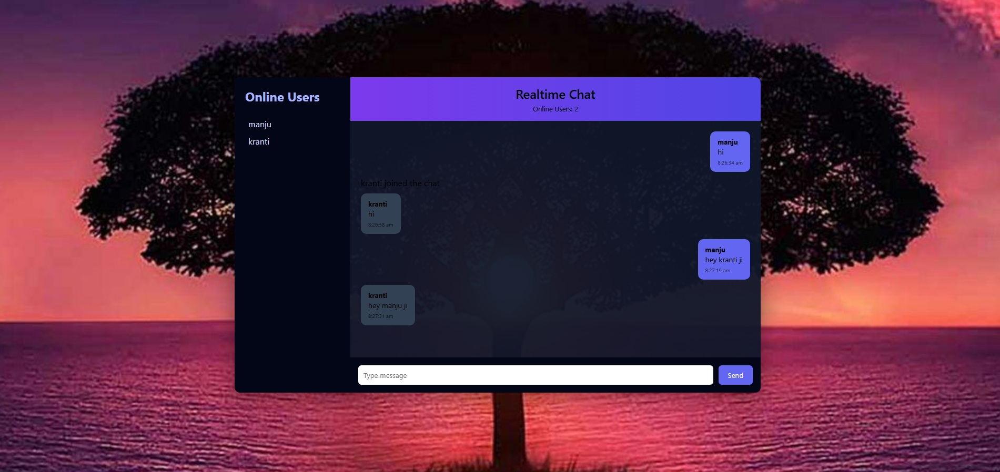

# Realtime Chat Application

A modern real-time chat application built using Node.js, Socket.IO, and MongoDB.

## Features

• Real-time messaging using WebSockets  
• Multiple users chat simultaneously  
• Online users count  
• Message timestamps  
• Message history stored in database  
• Modern chat UI

## Tech Stack

Frontend:
- HTML
- CSS
- JavaScript

Backend:
- Node.js
- Express.js
- Socket.IO

Database:
- MongoDB
- Mongoose

## How It Works

1. User opens the chat interface
2. Socket connection is created
3. Messages are sent to server
4. Server broadcasts message to all connected users
5. Messages are stored in MongoDB

## Installation

Clone the repository

```
git clone https://github.com/YOUR_USERNAME/realtime-chat-app.git
```

Install dependencies

```
npm install
```

Start the server

```
node server/server.js
```

Open in browser

```
http://localhost:3000
```

## Future Improvements

• Typing indicator  
• User avatars  
• Private messaging  
• File sharing  
• Message reactions

## Author

Kumari Sonali

## Screenshot
